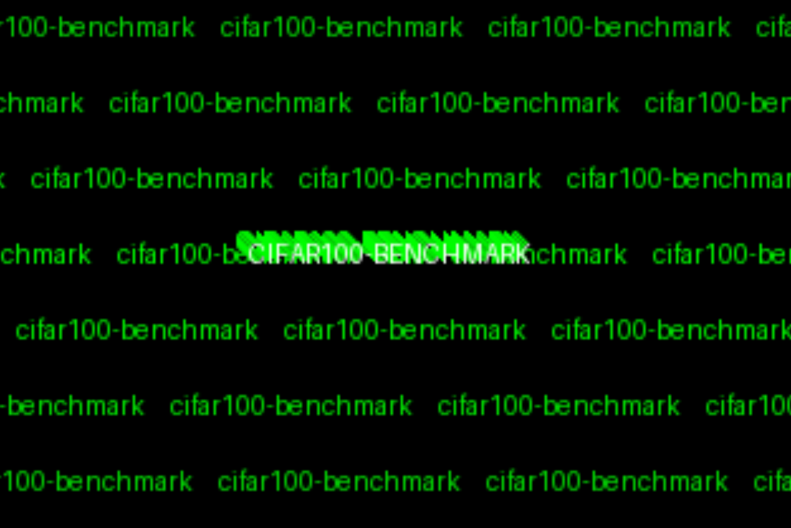
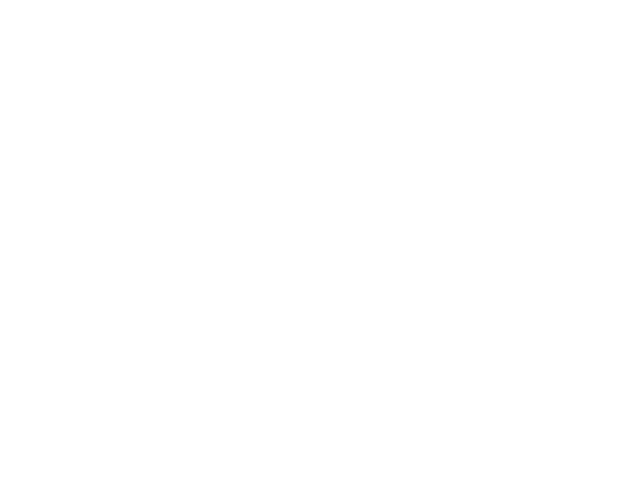
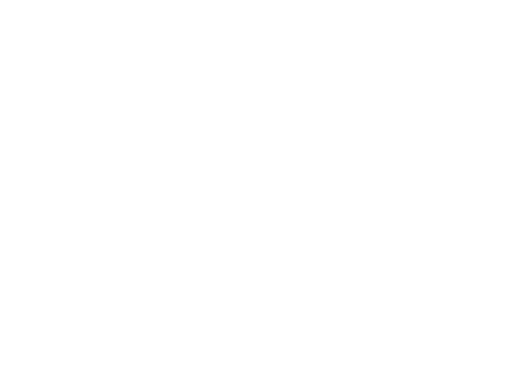

# cifar100-benchmark

这是一个用于CIFAR-100数据集基准测试的框架。该项目提供了完整的训练、验证和测试流程，您可以轻松导入自己的模型进行测试。

## 特点

- **模型自定义**: 项目中的CNN模型仅作为示例。您可以轻松替换成自己的模型，只需确保模型输入输出维度与数据集匹配即可
- **工具函数可扩展**: `utils.py`中提供了基础的训练和评估函数，您可以根据需要修改或扩展这些函数
- **完整的评估流程**: 包含训练、验证、测试的完整流程，支持模型性能的全面评估
- **灵活的数据处理**: 提供了数据加载和预处理的示例，可以根据需要调整数据增强策略

## 项目结构

### 主要文件说明

- `utils.py` 工具函数集合

  - `imshow(img)` 可视化图像。
  - `check_model(model)` 检查模型的前向传播、损失计算和参数量。
  - `logshow(log_file_path)` 可视化训练、验证和测试日志。
  - `train_one_epoch()` 训练一个 epoch，计算损失和准确率。
  - `validate_one_epoch()` 验证一个 epoch，计算损失和准确率。
  - `test_one_epoch()` 测试一个 epoch，计算损失和准确率。
  - `train_model()` 执行完整的训练流程，包括训练、验证和测试，并保存最佳模型和日志。
  - `predict()` 使用模型进行预测并显示准确率。

- `networks.py`: 示例模型实现
  - 提供了一个简单的CNN模型作为示例
  - 您可以替换成自己的模型实现
  - 建议参考该文件的接口设计：
    - **输入**: 形状为 `[batch_size, 3, 32, 32]` 的张量，适用于 3 通道的 32x32 图像
    - **输出**: 形状为 `[batch_size, num_classes]` 的张量，适用于分类任务，默认 `num_classes=100`

- `data_get.ipynb`: 数据加载和预处理示例
  - 展示了基本的数据处理流程
  - 可以根据需要修改数据增强策略
  - 训练集/验证集比例可调整

- `train.ipynb`: 训练流程示例
  - 展示了完整的模型训练和评估流程
  - 可以作为使用自定义模型的参考

## 数据集信息

- 使用CIFAR-100数据集
- 默认划分：
  - 训练集：40000张图片
  - 验证集：10000张图片
  - 测试集：10000张图片
- 图像尺寸：32x32x3
- 类别数：100

## 快速开始

1. 准备您的模型：
   - 参考`networks.py`中的示例模型
   - 确保模型接受3通道32x32输入
   - 确保模型输出100维向量

2. 自定义训练流程（可选）：
   - 根据需要修改`utils.py`中的函数
   - 可以添加新的评估指标
   - 可以修改训练策略

3. 运行评估：
   - 使用`train.ipynb`作为参考
   - 根据需要调整超参数
   - 记录和比较模型性能 

